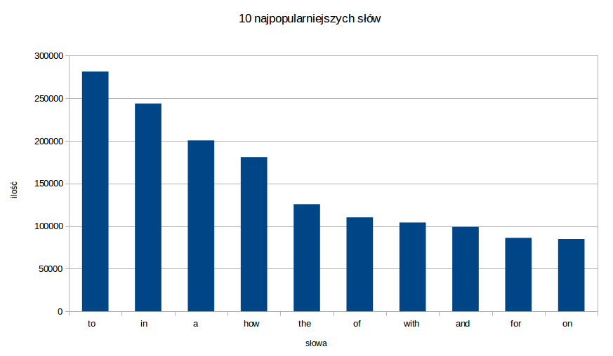
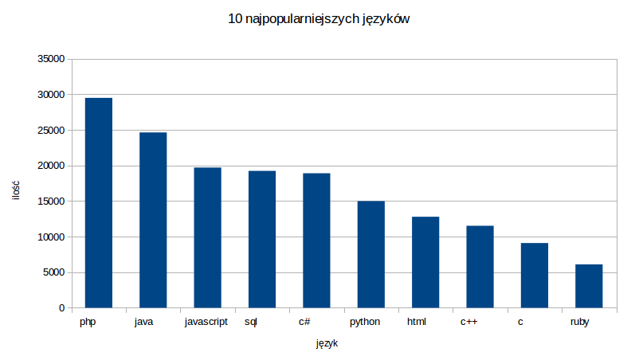
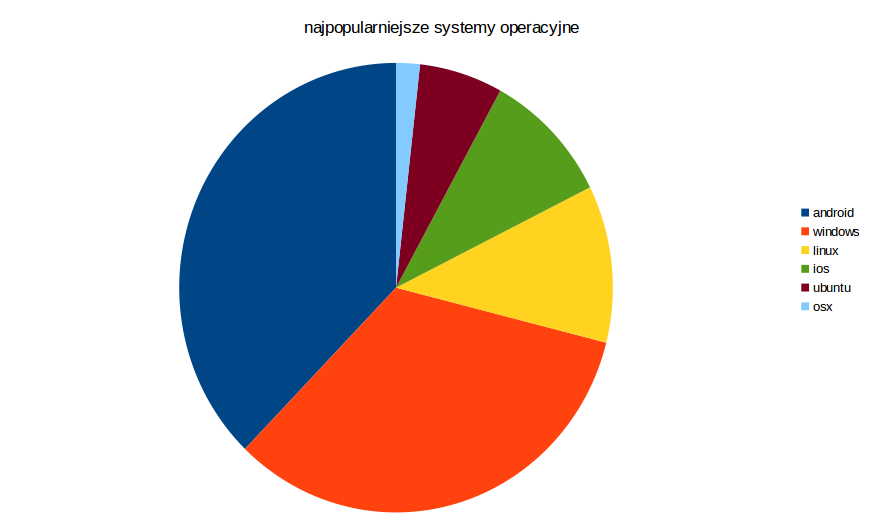

#MongoDB - MapReduce

##Spis treści

* [Dane](#dane)
* [Import](#import)
* [MapReduce](#mapreduce)
* [Przegląd wyniku](#przegl%C4%85d-wyniku)

##Dane

Skorzystamy z danych udostępnionych na ten konkurs [Identify keywords and tags from millions of text questions](https://www.kaggle.com/c/facebook-recruiting-iii-keyword-extraction) przez [Stack Exchange](http://stackexchange.com/):

 * [`Train.zip` o rozmiarze `2.19 GB`](https://www.kaggle.com/c/facebook-recruiting-iii-keyword-extraction/download/Train.zip)

Archiwum `Train.zip` zawiera plik `Train.csv` (`6.8 GB`). Każdy rekord zawiera cztery pola `"Id","Title","Body","Tags"`:

 * `Id` – Unique identifier for each question
 * `Title` – The question's title
 * `Body` – The body of the question
 * `Tags` – The tags associated with the question (all lowercase, should not contain tabs `'\t'` or ampersands `'&'`)

Przykładowy rekord `CSV` z pliku `Train.csv`:

```csv
"2","How can I prevent firefox from closing when I press ctrl-w",
"<p>In my favorite editor […]</p>

<p>Rene</p>
","firefox"
```

###Przygotowanie danych

Wybieramy `1 000 000` najnowszych (ostatnich) wpisów z pliku `Train.csv`:

```sh
head -n 1 Train.csv > t1mln.csv
tail -n 1000000 Train.csv >> t1mln.csv
```

##Import

```sh
time mongoimport -d train -c train1 --type csv --headerline --file t1mln.csv 
```

###Wynik

```sh
connected to: 127.0.0.1
Sun Jan 19 13:03:18.005     Progress: 52103962/1202896973 4%
Sun Jan 19 13:03:18.005       43100 14366/second
Sun Jan 19 13:03:21.173     Progress: 103206500/1202896973  8%
Sun Jan 19 13:03:21.173       85800 14300/second
...
Sun Jan 19 13:04:57.011     Progress: 1183729200/1202896973 98%
Sun Jan 19 13:04:57.011       984100  9648/second
Sun Jan 19 13:04:59.351 check 9 1000001
Sun Jan 19 13:04:59.442 imported 1000000 objects
```

###Czasy

```sh
real  1m44.356s
user  0m29.771s
sys   0m2.286s
```

W ciągu `1m44.356s` zaimportował się `1 000 000` rekordów, co daje `~9 615` insertów do bazy na sekundę.

##MapReduce

###Opis

*W tytułach ilu dokumentów występują konkretne słowa?*

Dla każdego słowa występującego w `tytule` chcemy policzyć w ilu dokumentach to słowo występuje.

Aby to policzyć użyjemy podwójnego MapReduce. 

###MapReduce 1

Dla każdego słowa z `tytułu` dokumentu `emitujemy` klucz będący parą wartości `{słowo, id dokumentu}`. 

Spodziewamy się rekordów postaci:

```json
{ "_id" : { "word" : "#", "id" : 5034944 }, "value" : 1 }
```

Czyli każdy rekord zawiera ilość wystąpień danego słowa w danym dokumencie (tytule).

####Kod funkcji Map oraz Reduce

```js
var m = function (){
  var that = this;
  var tab = this.Title.match(/[\w\-\+\#]+/g);//A-Za-z
  if(tab !== null){
    tab.forEach(function(word) {
      emit({"word": word.toLowerCase(), "id": that.Id}, 1);
    });
  }
};

var r = function (key, values){
  return Array.sum(values);
};
```

####Wykonanie

```js
db.train1.mapReduce(m, r, {out: "wcdocs"});
```

####Wynik

```json
{
  "result" : "wcdocs",
  "timeMillis" : 1190246, //19m50.246s
  "counts" : {
    "input" : 1000000,
    "emit" : 8568588,
    "reduce" : 265882,
    "output" : 8282653
  },
  "ok" : 1,
}
```

###MapReduce 2

Dla każdego dokumentu z kolekcji `wcdocs`, które mają postać:

```json
{ "_id" : { "word" : "#", "id" : 5034944 }, "value" : 1 }
```

Emitujemy klucz będący słowem (`_id.word`). 

Spodziewamy się rekordów postaci:

```json
{ "_id" : "#", "value" : 542 }
```

Każdy rekord zawiera ilość dokumentów (tytułów), w których występuje dane słowo. Czyli to co chcieliśmy policzyć.

####Kod funkcji Map oraz Reduce

```js
var m2 = function (){
  emit(this._id.word, 1);
};

var r2 = function (key, values){
  return Array.sum(values);
};
```

####Wykonanie

```js
db.wcdocs.mapReduce(m2, r2, {out: "wc"});
```

####Wynik

```json
{
  "result" : "wc",
  "timeMillis" : 177780, //2m57.78s
  "counts" : {
    "input" : 8282653,
    "emit" : 8282653,
    "reduce" : 126714,
    "output" : 148759
  },
  "ok" : 1,
}
```

###Przegląd wyniku

####10 najpopularniejszych słów

```js
db.wc.find().sort({value: -1}).limit(10);
```

#####Wynik

```json
  { "_id" : "to",   "value" : 281389 }
  { "_id" : "in",   "value" : 243858 }
  { "_id" : "a",    "value" : 200548 }
  { "_id" : "how",  "value" : 180957 }
  { "_id" : "the",  "value" : 125759 }
  { "_id" : "of",   "value" : 110290 }
  { "_id" : "with", "value" : 104258 }
  { "_id" : "and",  "value" : 99115  }
  { "_id" : "for",  "value" : 86233  }
  { "_id" : "on",   "value" : 84930  }
```

#####Wykres



####10 najpopularniejszych języków

Języki zostały wybrane na podstawie tagów.

```js
db.wc.find({
  _id: {
    $in: [ 
    "c#", 
    "java", 
    "php", 
    "javascript", 
    "c++", 
    "python", 
    "sql", 
    "html", 
    "c", 
    "ruby"
    ] 
  }
}).sort({"value": -1});
```

#####Wynik

```json
  { "_id" : "php",        "value" : 29498 }
  { "_id" : "java",       "value" : 24642 }
  { "_id" : "javascript", "value" : 19711 }
  { "_id" : "sql",        "value" : 19238 }
  { "_id" : "c#",         "value" : 18899 }
  { "_id" : "python",     "value" : 14990 }
  { "_id" : "html",       "value" : 12790 }
  { "_id" : "c++",        "value" : 11528 }
  { "_id" : "c",          "value" : 9096  }
  { "_id" : "ruby",       "value" : 6097  }
```

#####Wykres




####Popularne systemy operacyjne

```js
db.wc.find({
  _id: {
    $in: [ 
    "android",
    "ios",
    "windows",
    "linux",
    "osx",
    "ubuntu"
    ] 
  }
}).sort({"value": -1});
```

#####Wynik

```json 
  { "_id" : "android",    "value" : 28375 }
  { "_id" : "windows",    "value" : 25059 }
  { "_id" : "linux",      "value" : 8502  }
  { "_id" : "ios",        "value" : 7253  }
  { "_id" : "ubuntu",     "value" : 4674  }
  { "_id" : "osx",        "value" : 1331  }
```

#####Wykres


